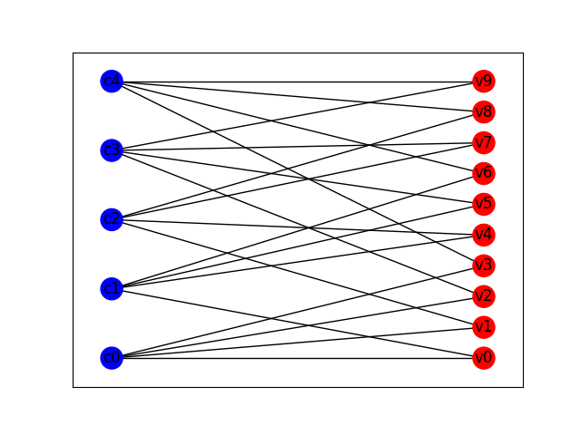

# Belief Propagation

This repo is aimed at providing an example implementation of belief propagation on Tanner graphs.

---

## API
One can create nodes (either variable or check nodes) via:
```python
from belief_propagation import VNode, CNode
v = VNode(name="v0")  # node name is optional
c = CNode(name="c0")
```

Creating a graph either from existing nodes, or new ones
```python
from belief_propagation import TannerGraph
import numpy as np
tg = TannerGraph()
# add 10 variable nodes
for i in range(10):
    tg.add_v_node(name="v"+str(i))
# add 5 check nodes
for i in range(5):
    tg.add_c_node(name="c"+str(i))
edges = {("v0", "c0"), ("v0", "c1"), ("v1", "c0"), ("v1", "c2"), ("v2", "c0"), ("v2", "c3"), ("v3", "c0"), ("v3", "c4"),
         ("v4", "c1"), ("v4", "c2"), ("v5", "c1"), ("v5", "c3"), ("v6", "c1"), ("v6", "c4"), ("v7", "c2"), ("v7", "c3"),
         ("v8", "c2"), ("v8", "c4"), ("v9", "c3"), ("v9", "c4")}
tg.add_edges_by_name(edges)

# Alternatively given a biadjacency matrix (parity check matrix) a graph can be constructed from it
H = np.array([[1, 1, 1, 1, 0, 0, 0, 0, 0, 0],
              [1, 0, 0, 0, 1, 1, 1, 0, 0, 0],
              [0, 1, 0, 0, 1, 0, 0, 1, 1, 0],
              [0, 0, 1, 0, 0, 1, 0, 1, 0, 1],
              [0, 0, 0, 1, 0, 0, 1, 0, 1, 1]])
tg = TannerGraph.from_biadjacency_matrix(H)
```

A graph may also be converted into a [NetworkX](https://networkx.org/) 
[Graph](https://networkx.org/documentation/stable/reference/classes/graph.html#networkx.Graph)
object. It can then be easily plotted using 
[NetworkX Draw](https://networkx.org/documentation/stable/reference/drawing.html), or 
[PyVis](https://pyvis.readthedocs.io/en/latest/index.html).
```python
from belief_propagation import TannerGraph
import numpy as np
H = np.array([[1, 1, 1, 1, 0, 0, 0, 0, 0, 0],
              [1, 0, 0, 0, 1, 1, 1, 0, 0, 0],
              [0, 1, 0, 0, 1, 0, 0, 1, 1, 0],
              [0, 0, 1, 0, 0, 1, 0, 1, 0, 1],
              [0, 0, 0, 1, 0, 0, 1, 0, 1, 1]])
tg = TannerGraph.from_biadjacency_matrix(H)
g = tg.to_nx()

import networkx as nx
import matplotlib.pyplot as plt
fig = plt.figure()
top = nx.bipartite.sets(g)[0]
labels = {node: d["label"] for node,d in g.nodes(data=True)}
nx.draw_networkx(g,
                 with_labels=True,
                 node_color=[d["color"] for d in g.nodes.values()],
                 pos=nx.bipartite_layout(g, top),
                 labels=labels)
fig.show()
```
