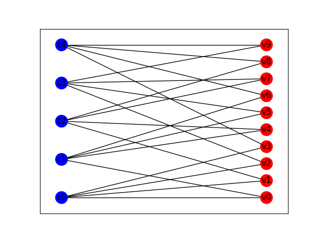

# Belief Propagation

This repo is aimed at providing an example implementation of belief propagation on Tanner graphs as used by a standard
LDPC decoder.

If you see bug, wish suggest something or contribute please open an [issue](./issues/new/choose).
Alternatively you can also contact me via [email](mailto:yairmazal@gmail.com?subject=[GitHub]%20Belief%20Propagation).

---

## API

### Nodes

One can create nodes (either variable or check nodes) via:
```python
from belief_propagation import VNode, CNode, bsc_llr
v = VNode(name="v0", channel_model=bsc_llr(0.1))
c = CNode(name="c0")
```

### Graphs

Creating a graph:
```python
from belief_propagation import TannerGraph, bsc_llr
import numpy as np
tg = TannerGraph()
# add 10 variable nodes
for i in range(10):
    tg.add_v_node(name="v"+str(i), channel_model=bsc_llr(0.1))
# add 5 check nodes
for i in range(5):
    tg.add_c_node(name="c"+str(i))
edges = {("v0", "c0"), ("v0", "c1"), ("v1", "c0"), ("v1", "c2"), ("v2", "c0"), ("v2", "c3"), ("v3", "c0"), ("v3", "c4"),
         ("v4", "c1"), ("v4", "c2"), ("v5", "c1"), ("v5", "c3"), ("v6", "c1"), ("v6", "c4"), ("v7", "c2"), ("v7", "c3"),
         ("v8", "c2"), ("v8", "c4"), ("v9", "c3"), ("v9", "c4")}
tg.add_edges_by_name(edges)

# Alternatively given a biadjacency matrix (parity check matrix) a graph can be constructed from it
H = np.array([[1, 1, 1, 1, 0, 0, 0, 0, 0, 0],
              [1, 0, 0, 0, 1, 1, 1, 0, 0, 0],
              [0, 1, 0, 0, 1, 0, 0, 1, 1, 0],
              [0, 0, 1, 0, 0, 1, 0, 1, 0, 1],
              [0, 0, 0, 1, 0, 0, 1, 0, 1, 1]])
tg = TannerGraph.from_biadjacency_matrix(H, channel_model=bsc_llr(0.1))
```

A graph may also be converted into a [NetworkX](https://networkx.org/) 
[Graph](https://networkx.org/documentation/stable/reference/classes/graph.html#networkx.Graph)
object. It can then be easily plotted using 
[NetworkX Draw](https://networkx.org/documentation/stable/reference/drawing.html), or 
[PyVis](https://pyvis.readthedocs.io/en/latest/index.html).
```python
from belief_propagation import TannerGraph, bsc_llr
import numpy as np
H = np.array([[1, 1, 1, 1, 0, 0, 0, 0, 0, 0],
              [1, 0, 0, 0, 1, 1, 1, 0, 0, 0],
              [0, 1, 0, 0, 1, 0, 0, 1, 1, 0],
              [0, 0, 1, 0, 0, 1, 0, 1, 0, 1],
              [0, 0, 0, 1, 0, 0, 1, 0, 1, 1]])
tg = TannerGraph.from_biadjacency_matrix(H, channel_model=bsc_llr(0.1))
g = tg.to_nx()

import networkx as nx
import matplotlib.pyplot as plt
fig = plt.figure()
top = nx.bipartite.sets(g)[0]
labels = {node: d["label"] for node,d in g.nodes(data=True)}
nx.draw_networkx(g,
                 with_labels=True,
                 node_color=[d["color"] for d in g.nodes.values()],
                 pos=nx.bipartite_layout(g, top),
                 labels=labels)
fig.show()
```


### Belief Propagation
```python
from belief_propagation import BeliefPropagation, TannerGraph, bsc_llr
import numpy as np
# consider a parity check matrix
H = np.array([[1, 1, 1, 1, 0, 0, 0, 0, 0, 0],
              [1, 0, 0, 0, 1, 1, 1, 0, 0, 0],
              [0, 1, 0, 0, 1, 0, 0, 1, 1, 0],
              [0, 0, 1, 0, 0, 1, 0, 1, 0, 1],
              [0, 0, 0, 1, 0, 0, 1, 0, 1, 1]])

# Use it to construct a Tanner graph. Assume a BSC channel model with probability p=0.1  ofr bit flip
model = bsc_llr(0.1)
tg = TannerGraph.from_biadjacency_matrix(H, channel_model=model)

# let us assume the codeword [1,1,0,0,1,0,0,0,0,0] was sent, but due to a channel error the last bit got flipped
c = np.array([1, 1, 0, 0, 1, 0, 0, 0, 0, 1])
# consequently we get initially H.dot(c) % 2
# array([0, 0, 0, 1, 1])

# let us try to correct the error
bp = BeliefPropagation(tg, H, max_iter=10)
estimate, llr, decode_success = bp.decode(c)
# You can see that the error is corrected
```